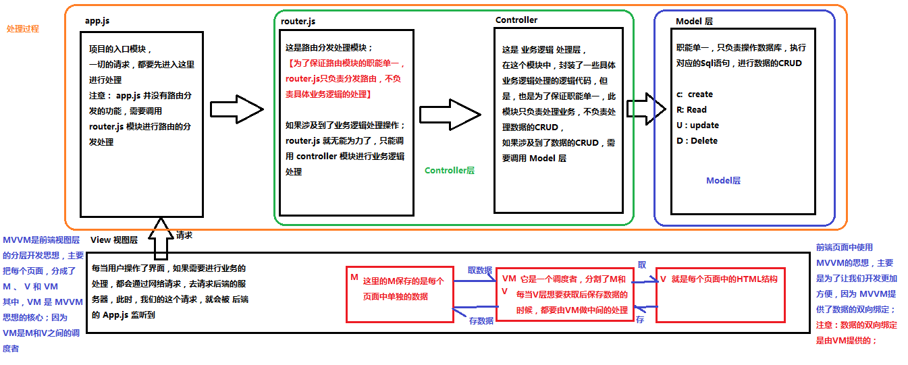

# Vue.js - Day1

## 课程介绍

前5天： 都在学习Vue基本的语法和概念；打包工具 Webpack , Gulp
后5天： 以项目驱动教学；

### 什么是Vue.js

- Vue.js 是目前最火的一个前端框架，React是最流行的一个前端框架（React除了开发网站，还可以开发手机App， Vue语法也是可以用于进行手机App开发的，需要借助于Weex）
- Vue.js 是前端的**主流框架之一**，和Angular.js、React.js 一起，并成为前端三大主流框架！
- Vue.js 是一套构建用户界面的框架，**只关注视图层**，它不仅易于上手，还便于与第三方库或既有项目整合。（Vue有配套的第三方类库，可以整合起来做大型项目的开发）
- 前端的主要工作？主要负责MVC中的V这一层；主要工作就是和界面打交道，来制作前端页面效果；


## 为什么要学习流行框架

- 企业为了提高开发效率：在企业中，时间就是效率，效率就是金钱；

- 企业中，使用框架，能够提高开发的效率；


- 提高开发效率的发展历程：原生JS -> Jquery之类的类库 -> 前端模板引擎 -> Angular.js / Vue.js（能够帮助我们减少不必要的DOM操作；提高渲染效率；双向数据绑定的概念【通过框架提供的指令，我们前端程序员只需要关心数据的业务逻辑，不再关心DOM是如何渲染的了】）
- 在Vue中，一个核心的概念，就是让用户不再操作DOM元素，解放了用户的双手，让程序员可以更多的时间去关注业务逻辑；


- 增强自己就业时候的竞争力

- 人无我有，人有我优
- 你平时不忙的时候，都在干嘛？

## 框架和库的区别


- 框架：是一套完整的解决方案；对项目的侵入性较大，项目如果需要更换框架，则需要重新架构整个项目。

- node 中的 express；



- 库（插件）：提供某一个小功能，对项目的侵入性较小，如果某个库无法完成某些需求，可以很容易切换到其它库实现需求。

- 1. 从Jquery 切换到 Zepto
- 2. 从 EJS 切换到 art-template

## Node（后端）中的 MVC 与 前端中的 MVVM 之间的区别

- MVC 是后端的分层开发概念；
- MVVM是前端视图层的概念，主要关注于 视图层分离，也就是说：MVVM把前端的视图层，分为了 三部分 Model, View , VM ViewModel
- 为什么有了MVC还要有MVVM
- 

## Vue.js 基本代码 和 MVVM 之间的对应关系

## Vue之 - `基本的代码结构`和`插值表达式`、`v-cloak`

#### `使用v-cloak能够解决 插值表达式闪烁的问题`

## Vue指令之`v-text`和`v-html`&`{{这个叫插值表达式}}`

1. `默认 v-test 是没有闪烁问题的`
2. `v-test 会覆盖元素中原本的内容，但是差值表达式只会替换自己的这个占位符，不会把整个元素内容清空`
3. `v-html 可以将data 里面的html字符串转为标签`

```html
<!DOCTYPE html>
<html>
	<head>
		<meta charset="UTF-8">
		<title></title>
		<script src="lib/js/vue.js"></script>
		<style>
			[ v-cloak] {
				display: none;
			}
		</style>
	</head>
	<body>
		<div id="app" v-html="msg">
		</div>
		<script>
			var vm = new Vue({
				el: '#app',
				data: {
					msg: '<h1>哈哈</h1>',
				}
			})
		</script>
	</body>

</html>
```


## Vue指令之`v-bind`的三种用法

v-bind :	是vue中，提供用于绑定属性的指令

1. 直接使用指令`v-bind`
2. 使用简化指令`缩写是冒号 :`
   1. 在绑定的时候，拼接绑定内容：`:title="btnTitle + '字符串'", 这是追加的内容'"`   属性加字符串是可以的

## Vue指令之`v-on`和`跑马灯效果`

### `v-on提供事件绑定机制` 

### 跑马灯效果

1. HTML结构：

```
<div id="app">
	<input type="button"value="浪起来"@click="lang" />
	<input type="button"value="别浪" @click="nolang"/>
	<h3>{{msg}}</h3>
</div>

```

2. Vue实例：

```
	// 创建 Vue 实例，得到 ViewModel
     // 注意：在 VM实例中，如果想要获取 data 上的数据，或者 想要调用 methods 中的 方法，必须通过 this.数据属性名  或  this.方法名 来进行访问，这里的this，就表示 我们 new 出来的  VM 实例对象
    var vm = new Vue({
      el: '#app',
      data: {
        msg: '猥琐发育，别浪~~！',
        intervalId: null // 在data上定义 定时器Id
      },
      methods: {
        lang() {
          // console.log(this.msg)
          // 获取到头的第一个字符
          // this

          if (this.intervalId != null) return;

          this.intervalId = setInterval(() => {
          		//=>ECS6语法，引入箭头函数有两个方面的作用：更简短的函数并且不绑定this。
            var start = this.msg.substring(0, 1)
            // 获取到 后面的所有字符
            var end = this.msg.substring(1)
            // 重新拼接得到新的字符串，并赋值给 this.msg
            this.msg = end + start
          }, 400)

          // 注意： VM实例，会监听自己身上 data 中所有数据的改变，只要数据一发生变化，就会自动把 最新的数据，从data 上同步到页面中去；【好处：程序员只需要关心数据，不需要考虑如何重新渲染DOM页面】
        },
        stop() { // 停止定时器
          clearInterval(this.intervalId)
          // 每当清除了定时器之后，需要重新把 intervalId 置为 null
          this.intervalId = null;
        }
      }
    })


    // 分析：
    // 1. 给 【浪起来】 按钮，绑定一个点击事件   v-on   @
    // 2. 在按钮的事件处理函数中，写相关的业务逻辑代码：拿到 msg 字符串，然后 调用 字符串的 substring 来进行字符串的截取操作，把 第一个字符截取出来，放到最后一个位置即可；
    // 3. 为了实现点击下按钮，自动截取的功能，需要把 2 步骤中的代码，放到一个定时器中去；

```


## Vue指令之`v-on的缩写`和`事件修饰符`

`v-on缩写是 @`

## 事件修饰符可以串联写

### 事件修饰符：

- .stop       阻止冒泡
- .prevent    阻止默认事件
- .capture    添加事件侦听器时使用事件捕获模式
- .self       只当事件在该元素本身（比如不是子元素）触发时触发回调
- .once       事件只触发一次
- `<input type="button"value="浪起来"@click.stop="lang" />`

 

## Vue指令之`v-model`和`双向数据绑定（唯一的数据双向绑定指令）`

```javascript
使用 v-model指令，可以实现表单元素和Model 中数据的双向绑定
```


## 简易计算器案例

1. HTML 代码结构

```
  <div id="app">

    <input type="text" v-model="n1">

    <select v-model="opt">

      <option value="0">+</option>

      <option value="1">-</option>

      <option value="2">*</option>

      <option value="3">÷</option>

    </select>

    <input type="text" v-model="n2">

    <input type="button" value="=" v-on:click="getResult">

    <input type="text" v-model="result">

  </div>

```

2. Vue实例代码：

```
	// 创建 Vue 实例，得到 ViewModel

    var vm = new Vue({

      el: '#app',

      data: {

        n1: 0,

        n2: 0,

        result: 0,

        opt: '0'

      },

      methods: {

        getResult() {

          switch (this.opt) {

            case '0':

              this.result = parseInt(this.n1) + parseInt(this.n2);

              break;

            case '1':

              this.result = parseInt(this.n1) - parseInt(this.n2);

              break;

            case '2':

              this.result = parseInt(this.n1) * parseInt(this.n2);

              break;

            case '3':

              this.result = parseInt(this.n1) / parseInt(this.n2);

              break;

          }

        }

      }

    });

```


## 在Vue中使用样式

### 使用class样式

1. 数组

```
<h1 :class="['red', 'thin']">这是一个邪恶的H1</h1>
```

2. 数组中使用三元表达式

```
<h1 :class="['red', 'thin', isactive?'active':'']">这是一个邪恶的H1</h1>
```

3. 数组中嵌套对象

```
<h1 :class="['red', 'thin', {'active': isactive}]">这是一个邪恶的H1</h1>
```

4. 直接使用对象

```
<h1 :class="{red:true, italic:true, active:true, thin:true}">这是一个邪恶的H1</h1>
```


### 使用内联样式

1. 直接在元素上通过 `:style` 的形式，书写样式对象

```
<h1 :style="{color: 'red', 'font-size': '40px'}">这是一个善良的H1</h1>
```

2. 将样式对象，定义到 `data` 中，并直接引用到 `:style` 中

- 在data上定义样式：

```
data: {
        h1StyleObj: { color: 'red', 'font-size': '40px', 'font-weight': '200' }
}
```

- 在元素中，通过属性绑定的形式，将样式对象应用到元素中：

```
<h1 :style="h1StyleObj">这是一个善良的H1</h1>
```

3. 在 `:style` 中通过数组，引用多个 `data` 上的样式对象

- 在data上定义样式：

```
data: {
        h1StyleObj: { color: 'red', 'font-size': '40px', 'font-weight': '200' },
        h1StyleObj2: { fontStyle: 'italic' }
}
```

- 在元素中，通过属性绑定的形式，将样式对象应用到元素中：

```
<h1 :style="[h1StyleObj, h1StyleObj2]">这是一个善良的H1</h1>
```


## Vue指令之`v-for`和`key`属性

1. 迭代数组

```
<ul>
  <li v-for="(item, i) in list">索引：{{i}} --- 姓名：{{item.name}} --- 年龄：{{item.age}}</li>
</ul>
```

2. 迭代对象中的属性

```
	<!-- 循环遍历对象身上的属性 -->

    <div v-for="(val, key, i) in userInfo">{{val}} --- {{key}} --- {{i}}</div>

```

3. 迭代数字

```
<p v-for="i in 10">这是第 {{i}} 个P标签</p>
//迭代数字，从1开始
```


> 2.2.0+ 的版本里，**当在组件中使用** v-for 时，key 现在是必须的。


当 Vue.js 用 v-for 正在更新已渲染过的元素列表时，它默认用 “**就地复用**” 策略。如果数据项的顺序被改变，Vue将**不是移动 DOM 元素来匹配数据项的顺序**， 而是**简单复用此处每个元素**，并且确保它在特定索引下显示已被渲染过的每个元素。

为了给 Vue 一个提示，**以便它能跟踪每个节点的身份，从而重用和重新排序现有元素**，你需要为每项提供一个唯一 key 属性。

v-for循环的时候，key属性只能使用number或者string


## Vue指令之`v-if`和`v-show`

v-if 特点：每次都会重新删除或创建元素

v-show特点：每次不会重新进行DOM的删除和操作，只是切换了元素的 display:none样式

v-if 有较高的切换性能消耗

v-show 有较高的初始渲染消耗

> 一般来说，v-if 有更高的切换消耗而 v-show 有更高的初始渲染消耗。因此，如果需要频繁切换 v-show 较好，如果在运行时条件不大可能改变 v-if 较好。

## 相关文章

1. [vue.js 1.x 文档](https://v1-cn.vuejs.org/)
2. [vue.js 2.x 文档](https://cn.vuejs.org/)
3. [String.prototype.padStart(maxLength, fillString)](http://www.css88.com/archives/7715)
4. [js 里面的键盘事件对应的键码](http://www.cnblogs.com/wuhua1/p/6686237.html)
5. [Vue.js双向绑定的实现原理](http://www.cnblogs.com/kidney/p/6052935.html)